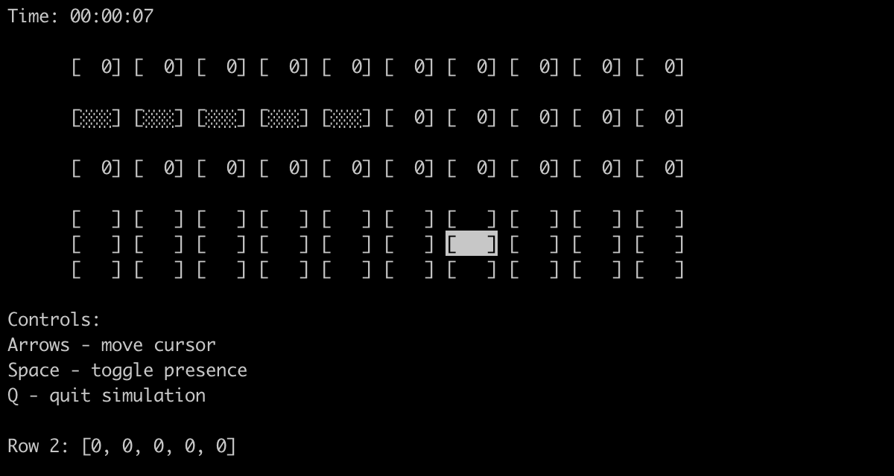
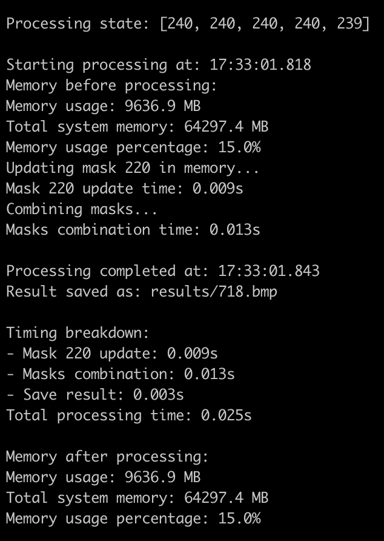

# Real-Time Image Generation System for Viewer-Dependent Landscapes
**Project: The Most Polish Landscape**

## System Architecture
The real-time image generation system consists of two main components: the TMPL Simulation and the TMPL Monitor. These components work together to generate and process landscape images based on viewer positions in real-time.

### TMPL Simulation (`tmpl_simulation.py`)
The TMPL Simulation is responsible for simulating the viewer interactions with the landscape and generating the corresponding state information. Key features of the simulation include:

- A grid-based representation of the landscape and visitor positions
- Saturation levels for each cell in the landscape grid
- Cursor-based navigation for simulating visitor movements
- Real-time updates of the landscape saturation based on visitor presence
- Logging of the landscape state changes to a file (`tmpl.log`)
- Interactive controls for adding/removing visitors and quitting the simulation
- Multithreading for concurrent updates and rendering

The simulation runs in a terminal interface using the `curses` library, allowing for real-time visualization of the landscape and visitor states.

### TMPL Monitor (`tmpl_monitor.py`)
The TMPL Monitor reads the state information generated by the TMPL Simulation and processes the corresponding landscape images in real-time. Key features of the monitor include:

- Monitoring of the `tmpl.log` file for state updates
- Loading and caching of landscape image sequences from disk
- Efficient image processing using NumPy and OpenCV
- Parallel processing of image save operations using ThreadPoolExecutor
- Generation of combined mask images based on predefined color mappings
- Performance optimizations such as caching, vectorized operations, and parallel processing
- Logging and performance metrics for analysis and optimization

The monitor continuously reads the state information from the log file, processes the relevant image frames, applies color mappings, and saves the generated images to disk. It optimizes performance through caching, parallel processing, and efficient image manipulation techniques.

## Image Processing Pipeline
1. The TMPL Simulation generates state information based on viewer interactions and logs it to the `tmpl.log` file.
2. The TMPL Monitor detects changes in the log file and reads the latest state information.
3. The monitor loads the relevant image frames from disk, leveraging caching mechanisms to minimize I/O operations.
4. The loaded image frames are merged using efficient NumPy operations to create a composite image.
5. The composite image is processed to generate a colored mask based on predefined color mappings.
6. The resulting images (original and colored mask) are saved to disk using parallel processing techniques.
7. Performance metrics such as load time, merge time, and save time are logged for analysis and optimization.

## Performance Optimizations
Several performance optimizations have been implemented to enhance the system's efficiency:

- **Caching**: Image frames are cached in memory to minimize disk I/O operations. The caching mechanism uses a TTL (Time-To-Live) approach to invalidate stale cache entries.
- **Parallel Processing**: The saving of generated images is performed concurrently using ThreadPoolExecutor, leveraging multi-threading capabilities to speed up the process.
- **Vectorized Operations**: NumPy's vectorized operations are used for efficient merging and manipulation of image data, avoiding slow loops and improving performance.
- **Bitmap (BMP) Format**: The system utilizes the BMP image format for faster loading and saving compared to PNG. BMP provides a balance between image quality and processing speed.

## Key Findings
Based on the performance analysis, the following key findings were observed:

- BMP format significantly outperforms PNG in terms of loading and saving speed, with BMP being approximately 3.5x faster in total processing time.
- The most significant difference is observed in load time, where BMP is roughly 3.4x faster compared to PNG.
- Save time also shows a notable difference, with BMP being 2.6–5x faster than PNG.

These findings highlight the importance of choosing an appropriate image format (BMP) for optimizing the performance of the real-time image generation system.


## Installation
Clone the repository and install dependencies:

```bash
git clone https://github.com/speplinski/tmpl-simulation.git
cd tmpl-simulation/
pip3 install -r requirements.txt
```

## Data Preparation
Run the provided script to download and organize required data:

```bash
./download_data.sh
```

The data will be placed under the `landscapes/` directory in the correct structure.

## Usage

### Start the Simulation
In the first terminal window, start the simulation to interact with the grid-based landscape:

```bash
python3 tmpl_simulation.py
```

The simulation provides the following functionalities:
- **Grid-Based Representation**: Displays a grid in the terminal where each cell represents a part of the landscape.
- **Visitor Interaction**: Visitors can be added, removed, or moved using keyboard controls. Their presence affects the grid cells, such as increasing saturation levels.
- **Logging**: All actions and grid state changes are logged to tmpl.log, which is read by the monitor component.
- **Real-Time Updates**: The simulation dynamically updates and visualizes visitor positions and saturation levels.
- **Interactive Controls**:
  - **Arrow Keys**: Navigate the grid to simulate visitor movements.
  - **Add/Remove Visitors**: Dynamically adjust the number of visitors.

Below is an example screenshot of the simulation interface in the terminal:


### Start the Monitor
In the second terminal window, start the monitor to process the simulation data:

```bash
python3 tmpl_monitor.py
```

The monitor provides the following functionalities:
- **Log Monitoring**: Continuously reads the `tmpl.log` file for updates and extracts state information.
- **Image Loading and Caching**: Loads relevant image sequences from disk, caching them in memory to minimize disk I/O.
- **Image Merging**: Combines image frames into a composite output based on visitor interactions logged by the simulation.
- **Color Mapping**: Applies predefined color mappings to create visual masks of the updated grid states.
- **Image Saving**: Saves the generated images and masks to disk using parallel processing for efficiency.
- **Performance Logging**: Logs metrics such as image loading time, processing time, and saving time for analysis and optimization.
- **AI Integration**: The generated segmentation masks are processed in real time by dedicated AI models using the [TMPL Benchmark App](https://github.com/speplinski/tmpl-benchmark-app). These models analyze the masks based on viewer interactions and generate visual outputs.
- **Visualization**: The [TMPL Visualizer](https://github.com/speplinski/tmpl-visualizer) displays the AI-generated visuals based on segmentation masks, creating dynamic, interactive experiences for viewers.

Below is an example screenshot of the monitor interface in the terminal:


## Contribution
Feel free to submit issues or pull requests to improve the system. Contributions are welcome!

## License
This project is licensed under the [Creative Commons Attribution-NonCommercial-ShareAlike 4.0 International License](LICENSE.md). See the `LICENSE.md` file for full details.
